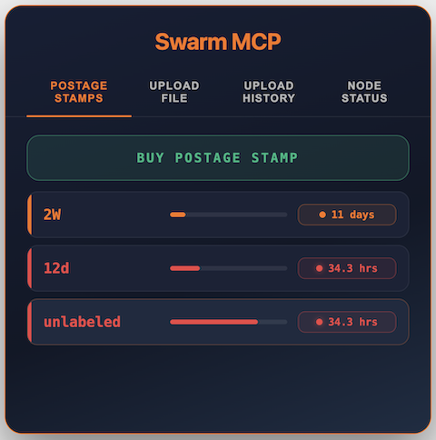
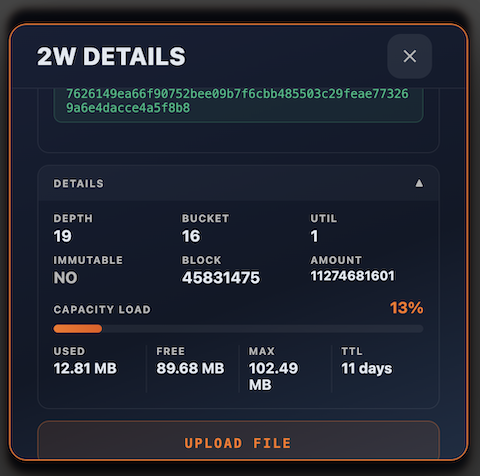
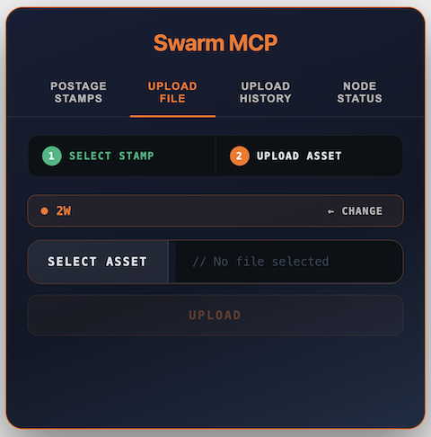
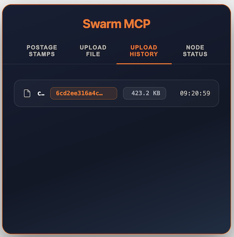
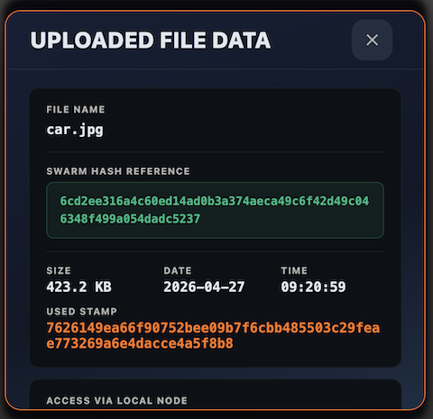
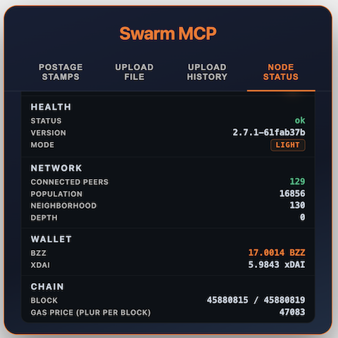

# Swarm MCP App Widget

The **Swarm MCP App Widget** is an interactive UI for managing Swarm storage inside your MCP client. Delivered as a single self-contained HTML file, rendered inline — no separate browser tab required.



---

## Setup

### VS Code Insider

> **Note:** The widget currently runs only in **Visual Studio Code Insider**. It is not supported in the stable VS Code release.

Create `.vscode/mcp.json` in the project root:

```json
{
  "inputs": [],
  "servers": {
    "Swarm": {
      "type": "stdio",
      "command": "node",
      "args": ["/absolute/path/to/swarm-mcp/dist/index.js"],
      "env": {
        "BEE_API_URL": "http://127.0.0.1:1633"
      }
    }
  }
}
```

To restart: open the Command Palette (`Cmd+Shift+P`) and run **MCP: Restart Server**.

### Other clients

For Claude Desktop, Windsurf, and Cursor see [Swarm MCP Client Setup](./mcp-client-setup.md).

---

## Invoking the Widget

Ask the AI assistant to open it.

```
Open the Swarm storage dashboard.
Show me my postage stamps.
I want to upload a file to Swarm.
```

---

## Sample Prompts

### Open the widget

- Show a visual interface where I can interact with the swarm.

### Postage Stamps

- Show the postage stamps on a visual interface.
- I want to buy a postage stamp visually.
- I want to buy an immutable postage stamp visually with name DEMO-1 and 100MB and 1d time to live.
- I would like to view the "DEMO" details of a postage stamp visually.
- I want to top up the "DEMO" postage stamp visually.
- I want to top up the "DEMO" postage stamp visually with 2d.

### Upload File

- I want to upload a file.
- I want to upload a file to the "DEMO" stamp.
- I want to upload a file to stamp that has more than 1d time to live.
- I want to upload a 100MB file.
- I want to upload a 10 MB file to a stamp that has less than 1d time to live.

### Upload History

- Show the detail of the last uploaded file.
- Show the recently uploaded files.

### Node Status

- Show the current node status.

---

## Tabs

### Postage Stamps

Lists all your postage stamp batches. Each stamp card shows:

- Label, batch ID (truncated), and status badge
- Capacity usage bar with percentage
- TTL (time to live) remaining — color-coded green/orange/red
- Buttons: **View Details**, **Extend**, **Upload File**

**View Details** opens the stamp detail modal showing batch hash, depth, bucket depth, utilization, and expiry date.



**Buy Postage Stamp** button opens a form to purchase a new batch:

| Field | Description |
|---|---|
| Size (MB) | Storage capacity to purchase |
| Duration | `1d`, `1w`, `1month`, or custom |
| Label | Optional human-readable name |
| Immutable | Toggle for immutable batches |

---

### Upload File

Two-step wizard for uploading a file to Swarm:

1. **Select a stamp** — pick from your existing postage batches
2. **Select a file** — choose a local file; image files show a preview

After upload, the Swarm reference hash is shown.



---

### Upload History

A log of all files uploaded through the widget during the session:

- File name, size, upload timestamp
- Swarm reference hash
- Stamp used

Click any row for the full reference hash and Swarm gateway URL.



The detail modal shows the full reference hash and a direct Swarm gateway URL.



---

### Node Status

Health and state of the connected Bee node:

- Connection status (connected / disconnected)
- Node mode: `full`, `light`, or `dev`
- Wallet balance (BZZ and xDAI)
- Current block number and chain ID
- Peer and topology info



---

## Backend Tools

Each widget action calls a tool from `src/tools/` — also available to the AI assistant.

| Tool | Description |
|---|---|
| `list_postage_stamps` | Load stamp list |
| `create_postage_stamp` | Buy a new stamp |
| `extend_postage_stamp` | Extend stamp capacity or TTL |
| `list_selected_stamps` | Show selected/pinned stamps |
| `upload_file` | Upload a file to Swarm |
| `list_upload_history` | Load upload history |
| `get_node_status` | Show node health and wallet |
| `get_storage_cost` | Estimate BZZ cost before buying |
| `open_url` | Open Swarm gateway URLs |

---

## Configuration

Uses the same environment variables as the MCP server:

| Variable | Default | Description |
|---|---|---|
| `BEE_API_URL` | `https://api.gateway.ethswarm.org` | Swarm Bee node endpoint |
| `BEE_FEED_PK` | — | Ethereum private key for feed operations |
| `AUTO_ASSIGN_STAMP` | `true` | Auto-select a stamp when none is specified |

See the main [README](../README.md#configuration-options) for full details.

---

## Building the Widget

Vite-bundled into a single HTML file. To rebuild:

```bash
npm run build:ui   # rebuild widget only
npm run build      # rebuild server + widget
```

Source files:
- `public/open-app/mcp-app.html` — HTML template
- `public/open-app/src/mcp-app.ts` — TypeScript logic
- `public/open-app/dist/mcp-app.html` — compiled output (served by MCP server)
